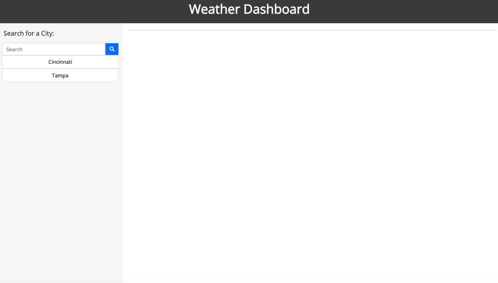
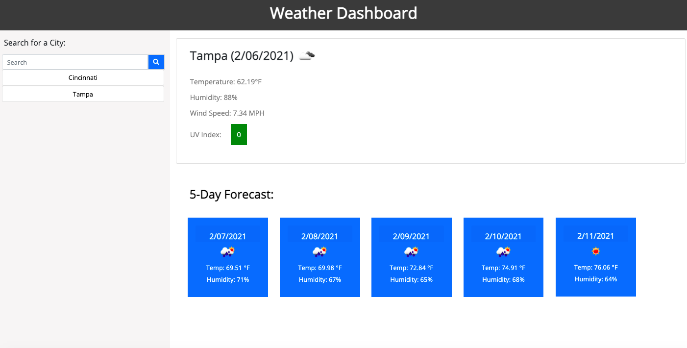

# Weather Dashboard

## Summary 

This app allows the user to look up the current and five-day forecast for the city they enter in the search as well as Humidity, UV Index, and Wind Speed. 

## Table of Contents

* [Deployed Application](#deployed-application)
* [Description](#description)
* [User Story](#user-stories)
* [Screen Shots](#screen-shots)
* [Links](#links)
* [Contributors](#contributors)

## Deployed Application

[https://sydneypo.github.io/weather-dashboard/](https://sydneypo.github.io/weather-dashboard/)

## Description

Weather Dashboard that features dynamically updated HTML and CSS. Uses the OpenWeather API to retrieve accurate and up-to-date weather data for cities. 

## User Story

```
AS A traveler
I WANT to see the weather outlook for multiple cities
SO THAT I can plan a trip accordingly

GIVEN a weather dashboard with form inputs
WHEN I search for a city
THEN I am presented with current and future conditions for that city and that city is added to the search history
WHEN I view current weather conditions for that city
THEN I am presented with the city name, the date, an icon representation of weather conditions, the temperature, the humidity, the wind speed, and the UV index
WHEN I view the UV index
THEN I am presented with a color that indicates whether the conditions are favorable, moderate, or severe
WHEN I view future weather conditions for that city
THEN I am presented with a 5-day forecast that displays the date, an icon representation of weather conditions, the temperature, and the humidity
WHEN I click on a city in the search history
THEN I am again presented with current and future conditions for that city
```

## Screen Shots





## Links

GitHub: [https://github.com/Sydneypo/weather-dashboard](https://github.com/Sydneypo/weather-dashboard)
Deployed on GitHub: [ https://sydneypo.github.io/weather-dashboard/](https://sydneypo.github.io/weather-dashboard/)

## Contributors

* Sydney Porter